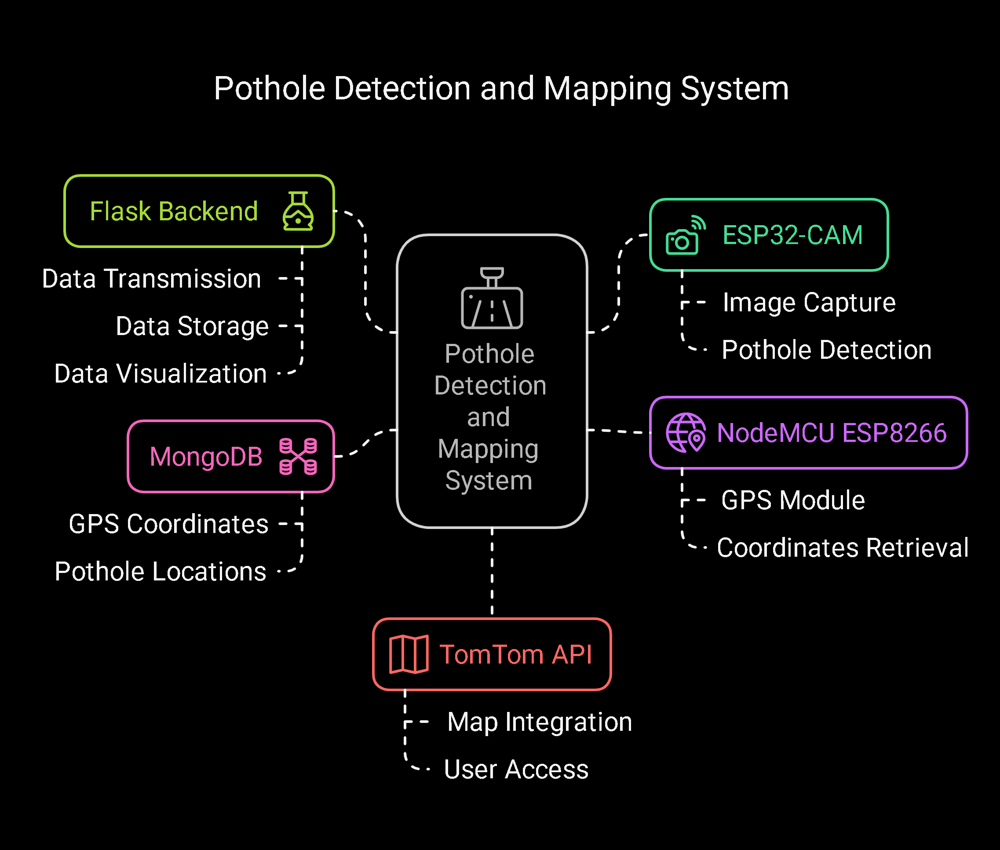
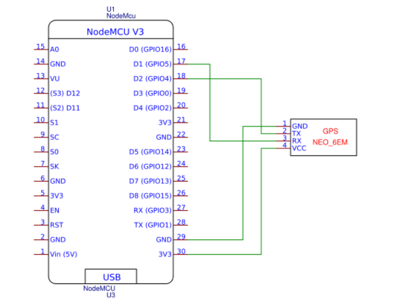
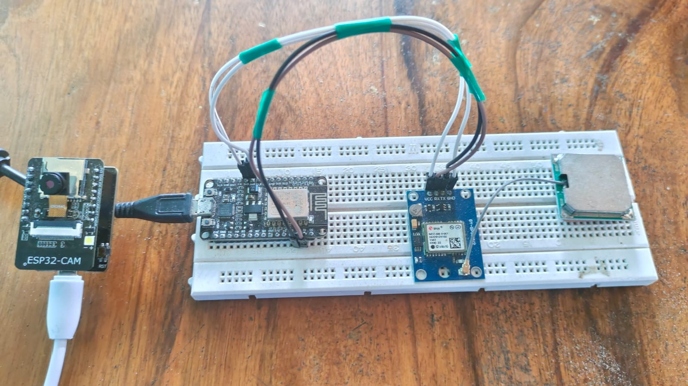

# 📌 Pothole Detection and Mapping System  

### 🚀 An IoT & AI-powered approach to real-time pothole detection and visualization  

---  

## 📚 Overview  
This project focuses on detecting potholes using an **ESP32-CAM** with an **Edge Impulse ML model** and mapping their locations using **GPS and MongoDB**.  

- The **ESP32-CAM** captures images and detects potholes using a deployed ML model.  
- A **NodeMCU ESP8266** is connected to a GPS module to fetch the location coordinates.  
- Once a pothole is detected, the ESP32-CAM fetches the latitude and longitude from the NodeMCU and sends the data to a **Flask backend** via a **POST request**.  
- The backend stores pothole locations in **MongoDB** and visualizes them using the **TomTom API**.  

---  

## 🛠 Tech Stack  
### **Hardware Components**  
- **ESP32-CAM** – Captures images and runs the Edge Impulse ML model  
- **NodeMCU ESP8266** – Fetches GPS coordinates  
- **GPS Module (NEO-6M)** – Provides latitude & longitude  

### **Software & Frameworks**  
- **Flask (Python)** – Backend server and API development  
- **MongoDB** – NoSQL database to store pothole locations  
- **Edge Impulse** – Machine learning model deployment for pothole detection  
- **TomTom API** – Visualizes pothole locations on an interactive map  

---  
### **System Architecture**


---
## 🔌 Connection Diagram / Table  


---  

## 📸 Circuit Images  


---  

## ⚙️ Working Flow  
1. **ESP32-CAM** captures an image.  
2. The **Edge Impulse ML model** processes the image to detect potholes.  
3. If a pothole is detected, **ESP32-CAM** requests GPS data from **NodeMCU ESP8266**.  
4. The **NodeMCU** fetches the location from the GPS module.  
5. ESP32-CAM sends **pothole + location data** to the **Flask backend** via **POST request**.  
6. The backend **stores data in MongoDB**.  
7. The **TomTom API** retrieves stored pothole locations and marks them on a map for visualization.  

---  

## 🌐 API Endpoints  
| Endpoint               | Method | Description |
|------------------------|--------|-------------|
| `/`                    | `GET`  | Displays pothole locations on the map |
| `/api/store_pothole`   | `POST` | Stores pothole location in the database |
| `/api/locations`       | `GET`  | Retrieves all stored pothole locations |

---  

## 🎥 Implementation  
 
## 🎥 Demo Video  
[](https://www.youtube.com/watch?v=8lgELFUhNPc)

---  

## 🛠️ Setup Instructions  
### **1️⃣ Clone the Repository**  
```sh
git clone https://github.com/Balamurugan1196/Pothole-Detection-and-Mapping.git
cd Pothole-Detection-and-Mapping
```

### **2️⃣ Install Dependencies**  
Ensure you have Python installed, then run:  
```sh
pip install -r requirements.txt
```

### **3️⃣ Run the Flask Backend**  
```sh
python app.py
```

### **4️⃣ Deploy ESP32-CAM with Edge Impulse Model**  
- Train and deploy the Edge Impulse ML model on ESP32-CAM.  
- Ensure NodeMCU ESP8266 is properly connected to fetch GPS coordinates.  

### **5️⃣ Test API Endpoints**  
- Use **Postman** or **curl** to test `/api/store_pothole` and `/api/locations`.  
- Open the browser to visualize potholes on the **TomTom Map**.  

---  

## 🚀 Future Enhancements  
✅ **Real-time Notifications** – Alert authorities when a new pothole is detected  
✅ **Automatic Road Condition Analysis** – Improve ML model for better accuracy  
✅ **Mobile App Integration** – Allow users to report potholes through a mobile app  
✅ **Additional Mapping APIs** – Support multiple map providers for better visualization  
